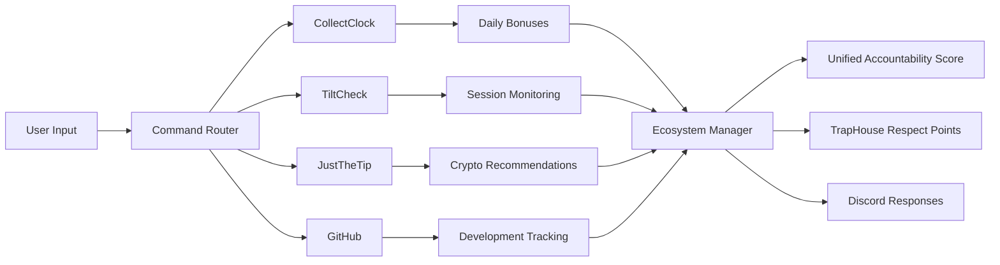

# TrapHouse Discord Bot - Complete Ecosystem Integration

## "Made for Degens by Degens" - Full System Status ✅

### 🎯 Core Integrations Active

#### 1. **CollectClock Integration** 🕐
- **Status**: ✅ FULLY OPERATIONAL
- **Features**: 15 gambling platforms, daily bonus tracking, streak monitoring
- **Commands**: `!cc`, `!collectclock`
- **Integration**: TrapHouse respect system, vault recommendations

#### 2. **TiltCheck Mischief Manager** 🎰
- **Status**: ✅ FULLY OPERATIONAL  
- **Features**: Real-time gambling session monitoring, tilt detection, accountability buddy
- **Commands**: `!tiltcheck`, `!tilt`
- **Personality**: Humor + genuine care + intervention system

#### 3. **JustTheTip Integration** 💰
- **Status**: ✅ INTEGRATED
- **Features**: Crypto vault recommendations based on gambling discipline
- **Logic**: CollectClock streaks + TiltCheck grades = personalized crypto advice

#### 4. **GitHub Integration** 🔧
- **Status**: ✅ ACTIVE
- **Features**: Repository management, webhook notifications, commit tracking
- **Integration**: Development accountability alongside gambling accountability

### 🔄 Ecosystem Flow

```
Daily Routine:
1. CollectClock tracks daily bonus collection (15 platforms)
2. TiltCheck monitors gambling sessions with Mischief Manager
3. JustTheTip provides crypto recommendations based on discipline
4. GitHub tracks development progress and commits
5. TrapHouse respect system rewards good decisions across all areas
```

### 🎮 Command Overview

#### CollectClock Commands
```bash
!cc start                    # Begin daily bonus collection tracking
!cc collect <platform>       # Mark platform bonus as collected
!cc status                   # View today's collection progress
!cc streak                   # Check collection streak stats
!cc platforms               # List all 15 supported platforms
!cc vault                   # Get personalized vault recommendations
!collectclock               # Show full help menu
```

#### TiltCheck Commands
```bash
!tiltcheck start <platform> <bankroll>    # Begin gambling session
!tiltcheck bet <stake> <win/loss> [payout] # Log individual bets  
!tiltcheck status                          # Current session stats
!tiltcheck end                             # End with grade & feedback
!tiltcheck history                         # Past session summaries
!tiltcheck intervention                    # Manual accountability check
```

#### Integration Commands
```bash
!ecosystem                  # View complete system status
!discipline                 # Cross-platform discipline score
!vault                     # JustTheTip recommendations
!github status             # Repository and commit tracking
```

### 🏆 Accountability Features

#### Mischief Manager Personality
- **Tilt Detection**: Real-time alerts for risky gambling patterns
- **Intervention System**: Caring but firm accountability 
- **Session Grading**: A+ to F grades with detailed feedback
- **Personality Responses**: Humor mixed with genuine concern

#### Cross-Platform Integration
- **CollectClock Streaks** influence **JustTheTip** crypto recommendations
- **TiltCheck Grades** affect **TrapHouse Respect** point earnings
- **GitHub Activity** shows development discipline alongside gambling discipline
- **Unified Accountability**: All systems work together for holistic improvement

### 🎯 Risk Management System

#### Real-Time Monitoring
- **Stake Escalation**: >200% bet size increase triggers alerts
- **Loss Sequences**: 5+ consecutive losses = intervention
- **Velocity Warnings**: 10+ bets/minute = slow down alerts  
- **Balance Protection**: 80% bankroll loss = emergency stop
- **Time Management**: 3+ hour sessions = mandatory breaks

#### Grading Algorithm
```javascript
Session Grade = (
    Discipline Score +
    Risk Management + 
    Time Control +
    Stake Management +
    Emotional Regulation
) / 5

A+ (90-100): 🏆 Exceptional control
A  (80-89):  🎯 Great discipline  
B  (70-79):  👍 Good with improvements
C  (60-69):  ⚠️ Concerning patterns
D  (50-59):  😬 Poor decisions
F  (<50):    🚨 Dangerous behavior
```

### 🔗 External Integrations

#### Supported Platforms (CollectClock)
1. **TrustDice** - Crypto casino bonuses
2. **Stake US** - Daily login rewards  
3. **MetaWin** - NFT gaming platform
4. **BC.Game** - Multi-crypto platform
5. **Roobet** - Social crypto gaming
6. **FortuneJack** - Bitcoin casino
7. **mBit Casino** - Multi-currency gaming
8. **BitStarz** - Hybrid casino platform
9. **7Bit Casino** - Crypto + fiat gaming
10. **PlayAmo** - Multi-platform gaming
11. **King Billy** - Themed slot platform
12. **Bob Casino** - Entertainment gaming
13. **Bizzo Casino** - Modern crypto platform
14. **CasinoChan** - Anime-themed gaming
15. **SpinSamurai** - Japanese-inspired platform

#### API Endpoints
- **Casino Management API**: Session tracking
- **Notification System**: Real-time alerts
- **Stake US Integration**: Direct bet logging
- **GitHub Webhooks**: Development tracking

### 📊 Data Flow Architecture



### 🎮 Usage Examples

#### Perfect Day Scenario
```
User: !cc start
Bot: 🌅 Daily collection tracking started! 15 platforms ready.

User: !cc collect trustdice
Bot: ✅ TrustDice collected! 1/15 platforms complete.

User: !tiltcheck start "Stake US" 100  
Bot: 🎰 Session started with Mischief Manager protection!

User: !tiltcheck bet 5 win 15
Bot: 🎉 Nice controlled bet! +$10 profit. Discipline level: HIGH

User: !tiltcheck end
Bot: 🏁 Session Grade: A+ 🏆 Perfect discipline shown!

User: !vault
Bot: 💰 Based on your excellent discipline: Consider DeFi staking with 70% allocation
```

#### Intervention Scenario  
```
User: !tiltcheck bet 10 loss
User: !tiltcheck bet 25 loss
User: !tiltcheck bet 50 loss

Bot: 🚨 TILT ALERT 🚨
     Stake escalation detected! 400% increase in bet size.
     Your inner degen is showing! Time to step back.
     
User: !tiltcheck bet 100 loss

Bot: 🆘 INTERVENTION TIME 🆘  
     Friend, we need to talk. 4 consecutive losses + dangerous stakes.
     Your Mischief Manager is concerned. Please consider ending session NOW.
```

### 🛡️ Safety Features

#### Built-in Protections
- **Automatic Session Limits**: Configurable time and loss thresholds
- **Escalation Alerts**: Multi-tier warning system
- **Emergency Interventions**: Critical pattern detection
- **Historical Tracking**: Long-term behavior analysis
- **Peer Accountability**: Community support integration

#### Mental Health Focus
- **Caring Language**: Humor balanced with genuine concern
- **Non-judgmental Approach**: Focus on growth, not shame
- **Resource Integration**: Links to help and support systems
- **Privacy Respect**: Data used for help, never against users

### 🚀 Future Enhancements

#### Planned Features
- [ ] **Machine Learning**: Predictive tilt detection
- [ ] **Social Features**: Accountability buddy matching  
- [ ] **Professional Integration**: Licensed counselor connections
- [ ] **Advanced Analytics**: Behavioral pattern recognition
- [ ] **Mobile App**: Standalone accountability companion

#### Community Requests
- [ ] **Custom Alert Sounds**: Personalized intervention tones
- [ ] **Group Challenges**: Community discipline competitions
- [ ] **Progress Visualization**: Detailed charts and graphs
- [ ] **Export Features**: Data portability for personal analysis

### 💡 Philosophy

> **"Made for degens by degens who learned the hard way"**

This ecosystem exists because someone who's been through gambling addiction, financial struggles, and the hard lessons of uncontrolled behavior wanted to build something that could help others avoid the same mistakes.

**Core Values:**
- **Accountability over Judgment**: Help, don't shame
- **Data over Emotions**: Facts guide better decisions  
- **Community over Isolation**: We're stronger together
- **Growth over Perfection**: Progress matters more than perfection
- **Mental Health over Profit**: Well-being trumps everything

### 🎯 Success Metrics

#### Individual Progress
- **Discipline Scores**: Trending upward over time
- **Session Grades**: Consistent B+ or higher ratings
- **Alert Frequency**: Decreasing intervention needs
- **Time Management**: Shorter, more controlled sessions
- **Financial Health**: Positive or controlled loss trends

#### Community Impact
- **Engagement**: Active use of accountability features
- **Support**: Peer assistance and encouragement
- **Growth**: Shared learning and improvement stories
- **Prevention**: Fewer crisis interventions needed

---

## 🎉 Integration Complete!

The TrapHouse Discord Bot now features a complete "made for degens by degens" ecosystem that combines:

✅ **Daily habit tracking** (CollectClock)  
✅ **Real-time gambling accountability** (TiltCheck Mischief Manager)  
✅ **Personalized crypto guidance** (JustTheTip)  
✅ **Development progress monitoring** (GitHub Integration)  
✅ **Unified community respect system** (TrapHouse Core)

### 🚀 **Deploy the Complete Ecosystem**

#### Discord Bot Applications:
1. **[TrapHouse Bot](https://discord.com/oauth2/authorize?client_id=1354450590813655142)** - Core community hub
2. **[CollectClock Bot](https://discord.com/oauth2/authorize?client_id=1336968746450812928)** - Daily bonus tracking  
3. **[Degens Bot](https://discord.com/oauth2/authorize?client_id=1376113587025739807)** - TiltCheck Mischief Manager
4. **[JustTheTip Bot](https://discord.com/oauth2/authorize?client_id=1373784722718720090)** - Crypto vault guidance

#### Enterprise Solutions:
- **[TiltCheck Enterprise](https://github.com/enterprises/tiltcheck)** - Professional gambling accountability

#### Developer Support:
- **GitHub**: [@jmenichole](https://github.com/jmenichole) | **[Sponsor](https://github.com/sponsors/jmenichole)**
- **LinkedIn**: [jmenichole0](https://linkedin.com/in/jmenichole0) | **[Ko-fi Support](https://ko-fi.com/jmenichole)**

**Your accountability buddy with personality is now live and ready to help you make decisions your future self will be proud of!** 🤝❤️
