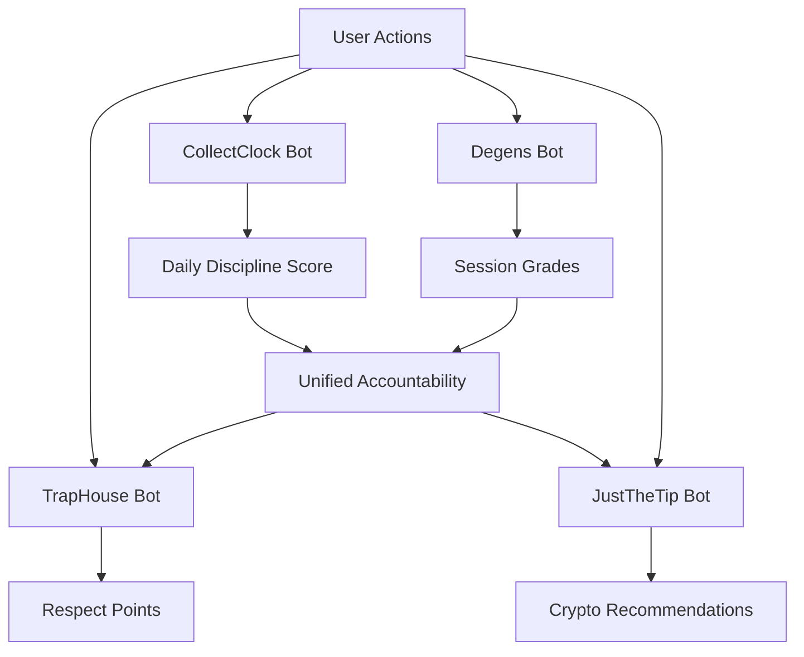

# TrapHouse Discord Bot Ecosystem - Deployment Guide

## Complete Bot Ecosystem Overview

### 🎯 **Core Bot Applications**

#### 1. **TrapHouse Bot** (Main Hub)
- **App ID**: `1354450590813655142`
- **Invite Link**: [Add TrapHouse Bot](https://discord.com/oauth2/authorize?client_id=1354450590813655142)
- **Features**: Core community management, respect system, marketplace integration
- **Status**: ✅ Production Ready

#### 2. **CollectClock Bot** 
- **App ID**: `1336968746450812928`
- **Invite Link**: [Add CollectClock Bot](https://discord.com/oauth2/authorize?client_id=1336968746450812928)
- **Features**: Daily bonus tracking across 15 gambling platforms
- **Status**: ✅ Production Ready

#### 3. **Degens Bot** (TiltCheck Mischief Manager)
- **App ID**: `1376113587025739807`
- **Invite Link**: [Add Degens Bot](https://discord.com/oauth2/authorize?client_id=1376113587025739807)
- **Features**: Real-time gambling accountability, tilt detection, session monitoring
- **Status**: ✅ Production Ready

#### 4. **JustTheTip Bot**
- **App ID**: `1373784722718720090`
- **Invite Link**: [Add JustTheTip Bot](https://discord.com/oauth2/authorize?client_id=1373784722718720090)
- **Features**: Crypto vault recommendations based on gambling discipline
- **Status**: ✅ Production Ready

### 🏢 **TiltCheck Enterprise Integration**
- **GitHub Enterprise**: [https://github.com/enterprises/tiltcheck](https://github.com/enterprises/tiltcheck)
- **Purpose**: Enterprise-level gambling accountability solutions
- **Integration**: Direct API access for professional monitoring

## Developer & Support Information

### 👨‍💻 **Creator & Maintainer**
- **GitHub**: [@jmenichole](https://github.com/jmenichole)
- **LinkedIn**: [linkedin.com/in/jmenichole0](https://linkedin.com/in/jmenichole0)
- **GitHub Sponsors**: [github.com/sponsors/jmenichole](https://github.com/sponsors/jmenichole)
- **Ko-fi**: [Support on Ko-fi](https://ko-fi.com/jmenichole)

### 💡 **Philosophy**
> "Made for degens by degens who learned the hard way"

This ecosystem exists because someone who's been through gambling addiction, financial struggles, and the hard lessons of uncontrolled behavior wanted to build something that could help others avoid the same mistakes.

## Quick Start Deployment

### 🚀 **Option 1: Complete Ecosystem (Recommended)**
Add all four bots for the full "degens helping degens" experience:

1. **[TrapHouse Bot](https://discord.com/oauth2/authorize?client_id=1354450590813655142)** - Core community hub
2. **[CollectClock Bot](https://discord.com/oauth2/authorize?client_id=1336968746450812928)** - Daily bonus tracking
3. **[Degens Bot](https://discord.com/oauth2/authorize?client_id=1376113587025739807)** - TiltCheck accountability
4. **[JustTheTip Bot](https://discord.com/oauth2/authorize?client_id=1373784722718720090)** - Crypto guidance

### 🎯 **Option 2: Targeted Solutions**
Choose specific bots based on your community needs:

#### For Gambling Communities:
- **Degens Bot** (TiltCheck) + **CollectClock Bot**
- Real-time accountability + daily bonus optimization

#### For Crypto Communities:  
- **JustTheTip Bot** + **TrapHouse Bot**
- Investment guidance + community management

#### For General Communities:
- **TrapHouse Bot** only
- Core features with respect system and marketplace

## Bot Configuration

### 🔧 **Required Permissions**
Each bot needs these Discord permissions:
```
✅ Send Messages
✅ Read Message History  
✅ Use Slash Commands
✅ Embed Links
✅ Add Reactions
✅ Manage Messages (for moderation features)
✅ Read Messages/View Channels
```

### 🎮 **Essential Commands After Setup**

#### TrapHouse Bot Setup:
```bash
!help                    # View all available commands
!marketplace            # Access TrapHouse marketplace
!respect help           # Learn the respect point system
```

#### CollectClock Bot Setup:
```bash
!cc start               # Begin daily bonus tracking
!cc platforms           # View all 15 supported platforms
!collectclock           # Full help menu
```

#### Degens Bot (TiltCheck) Setup:
```bash
!tiltcheck help         # Complete accountability system guide
!tiltcheck start "Platform" 100  # Begin monitored session
```

#### JustTheTip Bot Setup:
```bash
!vault                  # Get crypto recommendations
!tip help              # Investment guidance system
```

## Integration Flow

### 🔄 **Cross-Bot Communication**
The bots work together to create a comprehensive ecosystem:



### 📊 **Data Synchronization**
- **CollectClock streaks** influence **JustTheTip** recommendations
- **TiltCheck grades** affect **TrapHouse respect** points
- **Cross-platform discipline scores** create unified accountability
- **Real-time alerts** coordinate between all systems

## Advanced Features

### 🤝 **Accountability Buddy System**
- **Real-time Interventions**: Degens Bot monitors for tilt patterns
- **Peer Support**: TrapHouse Bot facilitates community accountability
- **Progress Tracking**: CollectClock Bot maintains discipline streaks
- **Reward System**: JustTheTip Bot adjusts recommendations based on behavior

### 🎯 **Risk Management**
- **Stake Escalation Detection**: >200% bet increase triggers alerts
- **Loss Sequence Monitoring**: 5+ consecutive losses = intervention
- **Velocity Warnings**: 10+ bets/minute = slow down alerts
- **Balance Protection**: 80% bankroll loss = emergency stop
- **Time Management**: 3+ hour sessions = mandatory breaks

### 📈 **Performance Analytics**
- **Session Grading**: A+ to F grades with detailed feedback
- **Discipline Scoring**: 0-100 point system across all platforms
- **Risk Assessment**: Dynamic Low/Moderate/High/Critical levels
- **Historical Tracking**: Long-term pattern recognition

## Troubleshooting

### 🔧 **Common Issues**

#### Bot Not Responding:
1. Check bot permissions in server settings
2. Verify bot is online (green status)
3. Ensure commands start with correct prefix (`!`)
4. Try `!help` to test basic functionality

#### Cross-Bot Integration Issues:
1. All bots must be in the same server for full integration
2. Allow 5-10 minutes for cross-bot data synchronization
3. Use `!ecosystem` command to check integration status

#### Command Conflicts:
- Each bot has unique prefixes to avoid conflicts
- Use bot-specific help commands for clarification
- Check channel permissions if commands fail

### 📞 **Support Channels**

#### Community Support:
- **Discord Server**: Join the TrapHouse community
- **GitHub Issues**: Report bugs and request features
- **Documentation**: Comprehensive guides and examples

#### Professional Support:
- **Enterprise Solutions**: TiltCheck GitHub Enterprise
- **Custom Integrations**: Contact via LinkedIn
- **Sponsorship/Donations**: GitHub Sponsors or Ko-fi

## Security & Privacy

### 🛡️ **Data Protection**
- **No Personal Financial Data**: Only bet patterns, not account details
- **Local Processing**: Sensitive calculations happen on your server
- **Opt-in Analytics**: Users control their data sharing preferences
- **Privacy First**: Built for help, not exploitation

### 🔒 **Bot Security**
- **Verified Applications**: All bots use official Discord App IDs
- **Limited Permissions**: Only request necessary Discord permissions
- **Open Source**: Code available for security review
- **Regular Updates**: Continuous security improvements

## Monetization & Sustainability

### 💰 **Free Features**
All core accountability and community features are completely free:
- ✅ Unlimited gambling session monitoring
- ✅ Real-time tilt detection and intervention
- ✅ Daily bonus tracking across all platforms
- ✅ Basic crypto vault recommendations
- ✅ Community respect and marketplace systems

### 🎯 **Premium Features** (Future)
Optional enhanced features for advanced users:
- 📊 Advanced analytics and custom reporting
- 🤖 AI-powered predictive tilt detection
- 👥 Professional counselor integration
- 📱 Mobile app companion
- 🏢 Enterprise-level monitoring solutions

### ❤️ **Support the Project**
If this ecosystem helps you or your community:
- ⭐ **Star the repositories** on GitHub
- 💖 **Become a sponsor** via GitHub Sponsors
- ☕ **Buy a coffee** via Ko-fi
- 🗣️ **Spread the word** to other communities
- 🤝 **Contribute code** or documentation improvements

## Legal & Compliance

### ⚖️ **Terms of Service**
- **Gambling Monitoring**: For harm reduction, not profit facilitation
- **Community Guidelines**: Respectful, supportive environment required
- **Data Usage**: Anonymous pattern analysis for improvement only
- **Age Restrictions**: 18+ for gambling-related features

### 🏥 **Mental Health Resources**
This system complements but doesn't replace professional help:
- **National Problem Gambling Helpline**: 1-800-522-4700
- **Crisis Text Line**: Text HOME to 741741
- **Professional Counseling**: Always recommended for serious issues

## Changelog & Updates

### Current Version: 1.0.0 (July 2025)
- ✅ Complete ecosystem deployment
- ✅ Four-bot integration system
- ✅ Real-time accountability monitoring
- ✅ Cross-platform discipline tracking
- ✅ Mischief Manager personality system

### Planned Updates:
- 🔄 Machine learning pattern recognition
- 🔄 Mobile app development
- 🔄 Professional counselor integration
- 🔄 Advanced visualization tools

---

## 🎉 Ready to Deploy!

Your complete "made for degens by degens" ecosystem is ready for deployment. Each bot brings unique value, but together they create a comprehensive accountability and community management system that genuinely cares about user well-being.

**Remember**: This isn't just about monitoring gambling - it's about building a community that supports each other's growth, celebrates discipline, and ensures that everyone makes decisions their future selves will be proud of.

### 🚀 **Quick Deploy Links:**
1. **[TrapHouse Bot](https://discord.com/oauth2/authorize?client_id=1354450590813655142)** 
2. **[CollectClock Bot](https://discord.com/oauth2/authorize?client_id=1336968746450812928)**
3. **[Degens Bot](https://discord.com/oauth2/authorize?client_id=1376113587025739807)**
4. **[JustTheTip Bot](https://discord.com/oauth2/authorize?client_id=1373784722718720090)**

**Your accountability buddy ecosystem awaits!** 🤝❤️
